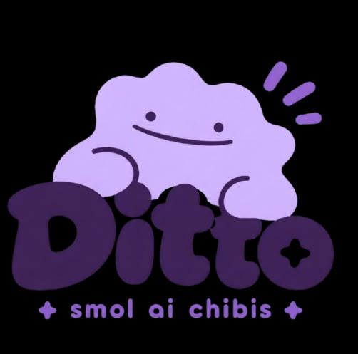

<p align="center">
  
</p>

<h1 align="center">Ditto</h1>

<p align="center">
  <em>Autonomous personal AI agents ("Dittodots") that work on their own machines.</em>
</p>

<p align="center">
  
  
  
  
  
</p>

---

## What is Ditto?

**Ditto** is an open-source, privacy-first personal agent environment. It provides background AI companions and agents (**Dittodots**) capable of:
- Operating their own sandboxed browsers and screen automation.
- Executing background tasks, workflows, and scheduled routines.
- Connecting to **1,500+ apps and services** via Composio OAuth.
- Running on local machines, Docker containers, or cloud sandboxes ([E2B](https://e2b.dev)).
- Expressing personalities through interactive **3D WebGL animations** (idle sways, waves, squash & stretch, eye blinks, and accessories).
- Communicating via realtime conversational voice (powered by OpenAI Realtime) or text chats with open-weight & frontier models (GPT-5, Kimi, DeepSeek, Qwen, Gemma, Llama).

---

##  Key Capabilities

### 1. Interactive 3D Dittodots
- **Full 3D WebGL Characters**: Powered by Three.js & React Three Fiber. Each Dittodot reacts dynamically to its workload—waving when idle, bobbing and stepping when working, or dozing off when paused.
- **Custom Looks**: Customizable shapes, colors, eye styles, textures, and accessories (halos, hats, sprouts, and antennas).

### 2. Isolated Browser & Computer Control
- **Persistent Browsing Sessions**: Every agent operates an isolated, authenticated browser instance via Playwright. Watch live interactions in real-time or take control to solve captchas and 2FA.
- **Encrypted Local Vault**: Credentials and tokens are saved locally in an encrypted vault and typed directly into input fields without leaking plaintext passwords to the LLM.

### 3. 1,500+ App Integrations & Governance
- **Composio Ecosystem**: Native connections to Gmail, Google Calendar, Slack, Notion, GitHub, Spotify, and 1,500+ workplace tools.
- **Human-in-the-Loop Safeguards**: Define custom approval rules (e.g. *"require confirmation before sending an email"*). A lightweight guardian model flags sensitive operations with interactive confirmation cards.

### 4. Realtime Voice & Scheduled Routines
- **Low-Latency Conversational Voice**: Talk directly with your agents using OpenAI Realtime over WebRTC/WebSocket. Background tasks keep running when you hang up.
- **Cron Routines & Webhooks**: Automate recurring daily summaries or configure webhook listeners to react to external triggers.

---

##  Getting Started

### Prerequisites
- **Node.js**: >= 22
- **pnpm**: >= 10
- **Chromium / Playwright**: For browser automation (`npx playwright install chromium`)

### Installation & Setup

```bash
# 1. Clone the repository
git clone https://github.com/saalineo/ditto.git
cd ditto

# 2. Install dependencies (using Bun or pnpm)
bun install
# or: pnpm install

# 3. Configure environment
cp .env.example .env.local

# 4. Install Playwright Chromium browser (for local automation)
npx playwright install chromium
```

### Running the Application

#### 🖥️ Option A: Native Desktop App (Electrobun + Bun)
Runs the application in a lightweight, hardware-accelerated native desktop window:

```bash
# Run in development mode (hot-reloading native window)
bun run desktop:dev

# Build standalone desktop distribution binary
bun run desktop:build
```

#### 🌐 Option B: Web Application (Next.js Dev Server)
Runs the application in your local browser:

```bash
pnpm dev
# or: bun run dev
```

Visit [`http://localhost:3100`](http://localhost:3100) in your web browser.

---

##  Configuration & In-App Settings

You can configure settings directly in the app's **Settings** panel (`/settings`) or via `.env.local`:

1. **AI Models & API Keys**:
   - Add your **OpenAI API Key** (for GPT models, Realtime Voice, and Embeddings).
   - Add your **OpenRouter API Key** (for open-source models like DeepSeek, Qwen, Kimi, GLM, Llama).
2. **App Connections**:
   - Connect your workplace accounts via Composio OAuth with a single click.
3. **Cloud Sandboxes (Optional)**:
   - Provide an **E2B API Key** for autonomous cloud compute while your device is asleep.

---

##  Environment Variables

| Variable | Default | Description |
|:---|:---|:---|
| `OPENAI_API_KEY` | *None* | OpenAI API Key (or set in UI Settings) |
| `OPENROUTER_API_KEY` | *None* | OpenRouter API Key for open-weight models |
| `COMPOSIO_API_KEY` | *None* | Composio API Key for event triggers |
| `DOTS_MODEL` | `gpt-5.5` | Primary agent model |
| `DOTS_REVIEW_MODEL` | `gpt-5.4-mini` | Safety governance & chat classifier |
| `DOTS_VOICE_MODEL` | `gpt-realtime-2.1` | Realtime voice session model |
| `DOTS_COMPUTER_TOOL` | `computer` | Screen interaction mode (`computer` \| `off`) |
| `E2B_API_KEY` | *None* | E2B Key for cloud execution sandbox |
| `DOTS_COMPUTER` | `auto` | Execution backend (`local` \| `docker` \| `cloud`) |
| `DOTS_DATA_DIR` | `.data/` | Local SQLite database & file storage directory |
| `DOTS_PUBLIC_URL` | `http://localhost:3100`| Base application URL for OAuth callbacks |

---

##  Project Architecture

```
ditto/
├── public/
│   └── logo.jpeg         # App branding logo
├── src/
│   ├── app/              # Next.js App Router (pages, API routes, SSE streams)
│   ├── components/       # UI Components & 3D WebGL Canvas (Dot3D, Sidebar, Chat)
│   ├── lib/              # State store, types, and UI helpers
│   └── server/
│       ├── agent/        # Execution runtime, tool runners, & prompt pipelines
│       ├── computer/     # Sandbox backends (Playwright, Docker, E2B)
│       ├── composio.ts   # Composio OAuth & tool execution bridge
│       ├── triggers.ts   # Webhook & event triggers listener
│       ├── voice.ts      # OpenAI Realtime WebRTC bridge
│       ├── vault.ts      # Encrypted credential & token storage
│       ├── scheduler.ts  # Routine scheduling engine (Croner)
│       └── db.ts         # SQLite persistence engine (node:sqlite)
```

---

## 🛠️ Tech Stack

- **Desktop Framework**: [Electrobun](https://electrobun.dev/) & [Bun](https://bun.sh/)
- **Frontend**: [Next.js](https://nextjs.org) 16 (App Router, Turbopack), [React 19](https://react.dev), [Tailwind CSS v4](https://tailwindcss.com)
- **3D Graphics & Animations**: [Three.js](https://threejs.org), [@react-three/fiber](https://r3f.docs.pmnd.rs), [@react-three/drei](https://github.com/pmndrs/drei)
- **AI & Reasoning**: [OpenAI Responses & Realtime API](https://platform.openai.com), [OpenRouter](https://openrouter.ai), [MCP](https://modelcontextprotocol.io/)
- **Tooling & Integrations**: [Composio](https://composio.dev) (1,500+ tools)
- **Computer & Browser Automation**: [Playwright](https://playwright.dev), [E2B Cloud Sandboxes](https://e2b.dev), Docker
- **Database**: SQLite (`bun:sqlite` with native WAL / `node:sqlite`)
